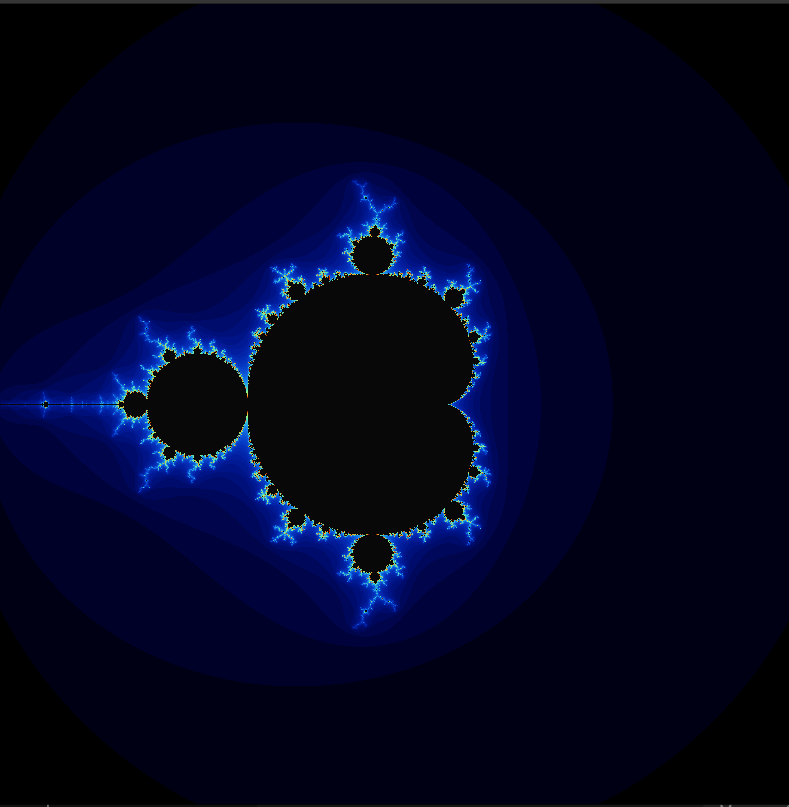
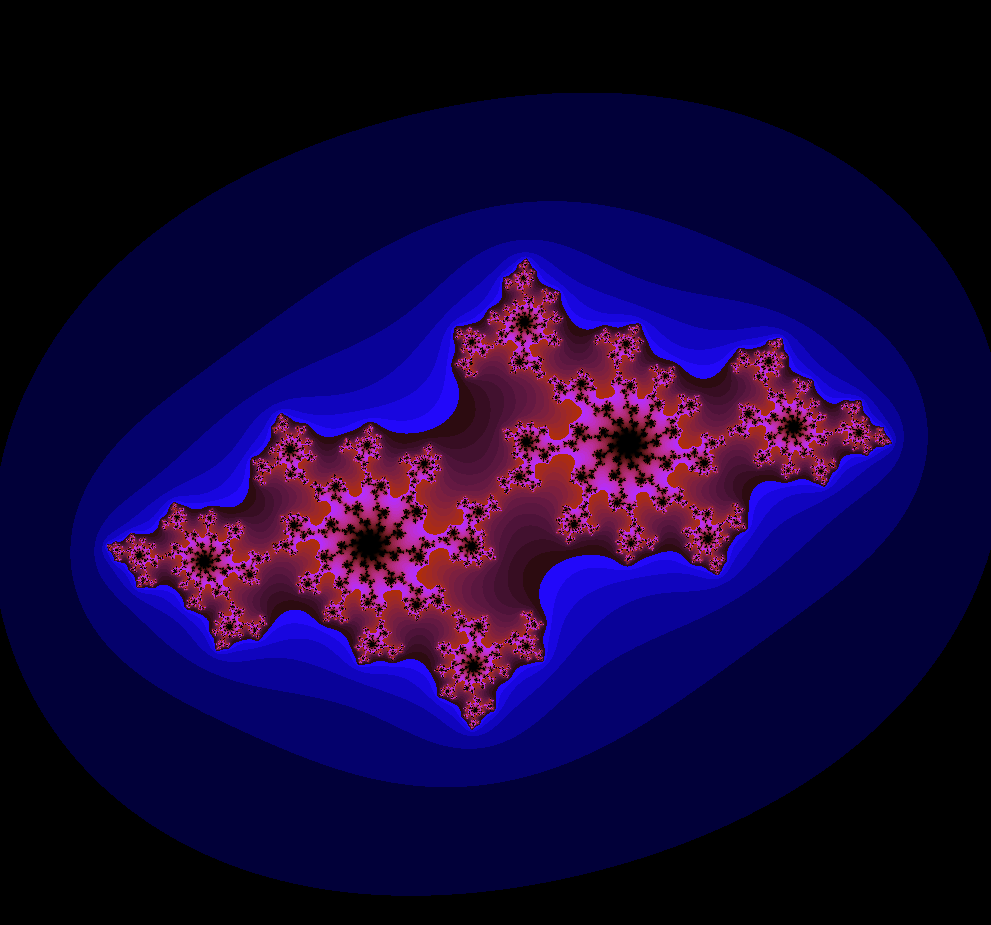
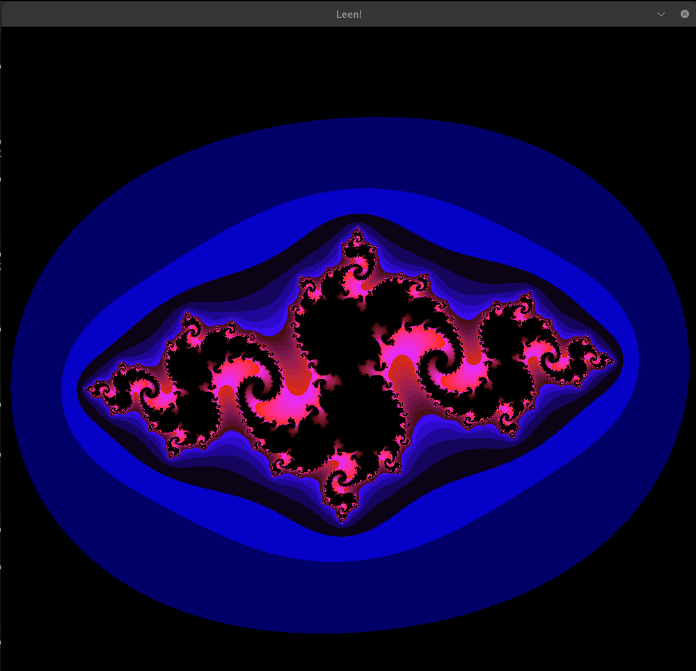

# Fract-ol 🌀

Fract-ol is a graphical program written in **C** that visualizes famous **fractal sets** such as the **Mandelbrot** and **Julia** sets using **MiniLibX**.  
The project focuses on complex numbers, mathematical visualization, event handling, and low-level graphics programming in C.

## 🎨 Screenshots

### Mandelbrot


### Julia Set


### Julia Set Variant


## 🎥 Demo

[Watch the fractal in action](video.webm)

## Features

- Display Mandelbrot and Julia fractals
- Smooth zoom in/out using mouse scroll
- Interactive exploration in a 900x900 window
- Custom Julia parameters via command line
- Clean window and resource management

## 💻 Requirements

- Linux (tested on Ubuntu)
- gcc or clang
- make
- X11 development libraries (`libx11-dev`)
- MiniLibX (included in the repository)
```Can install it:
git clone https://github.com/42Paris/minilibx-linux.git mlx_linux
make
````

## ⚡ Build

Clone the repository and compile the project:

```bash
git clone git@github.com:LeenAlmahthi/Fract-ol-.git
cd Fract-ol-
make
````
This will generate the executable:

```bash
./fractol
```

Rebuild everything from scratch:

```bash
make re
```

Clean object files:

```bash
make clean
```

## 🎮 Usage

Run the program by specifying the fractal type.

Mandelbrot:

```bash
./fractol mandelbrot
```

Julia (real and imaginary parts must be between -2 and 2):

```bash
./fractol julia 0.285 0.01
```

## 🕹️ Controls

Mouse:

* Scroll Up → Zoom in
* Scroll Down → Zoom out

Keyboard:

* ESC → Close the window

## 👤 Author

**Leen Almahthi** – 42 School

## 📌 Notes

* MiniLibX is included, no external installation required
* Zoom is centered on the mouse position
* Written according to 42 Norm
* Use `make re` if build issues occur
